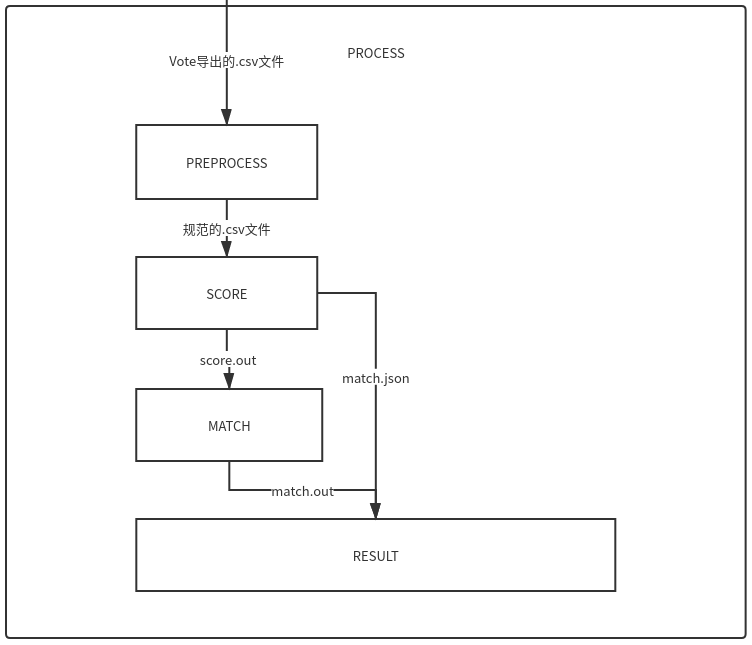
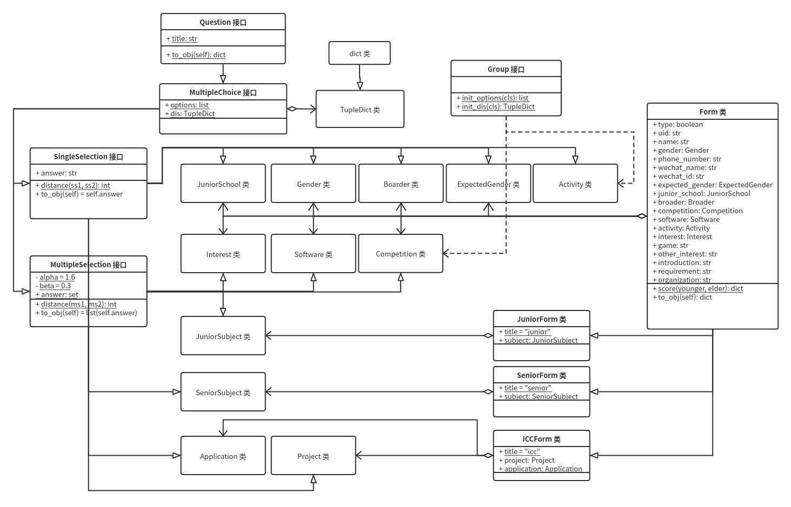

# one2one

## 流程介绍

一、 **收集**

    设计问卷，收集小朋友、大朋友的基本信息、兴趣爱好等数据。

    本次 One to One 使用了由 KEEER 独立编写的 Vote 表单平台。可扩展性是 KEEER Vote 最大的优势之一，因而我们只需要在 Vote 的基础上实现手机号验证与分支问题的插件即可。

二、 **处理**

    导出第一步收集到的数据，预处理、打分然后进行匹配。



    1. PREPROCESS: 从 Vote 导出的 .csv 文件中输入，对一些不合法数据（如同一个人填写了两份问卷）、冗余信息进行处理，然后将每个小朋友大朋友的姓名与手机号 hash 生成 uid 作为 key，根据年级进行分类，重新组织成规范的 .csv 文件。

    2. SCORE: .csv 文件中是非结构化数据，简单来说就是一些计算机无法理解的文本，所以我们需要把这些非结构化数据构造为数据模型上的结构化数据。例如，“你初中是人大附中本校的吗？”这个问题的回答“是”或“否”，对 true 或 false 而言，在一定程度上就是结构化的。构造为方便进一步处理的结构化数据后，对于任意潜在可行的小朋友-大朋友对，将每一个问题中小朋友与大朋友选项间的相似程度相加，得到小朋友与大朋友的总相似程度。最后，仅包含每个小朋友-大朋友对及其分数的数据将被输出到 score.out 中，而更详细、更冗余的数据将被输出到 score.json 中。

    3. MATCH: 从 score.out 中输入，然后进行匹配，将最终的小朋友-大朋友对输出到 match.out 中。

    4. RESULT: 从 match.out 和 score.json 中输入，一是仅保留 score.json 中所有最终小朋友-大朋友对的详细信息（由 match.out 给出），删除其他不可行的小朋友-大朋友对的信息，输出到 result.json；二是对于 match.out 中的所有最终小朋友-大朋友对，将小朋友的名字、大朋友的名字、手机号输出到 result.xls 中。

三、 **通知**

    以网页查询、辅以短信发送的形式进行通知。

    将 result.json 上载到 KEEER 服务器，设计一个表单与插件，使得小朋友大朋友可以在表单中输入自己的手机号，获取到对应的大朋友小朋友的名字、微信号等信息；将 result.xls 上载到阿里云，给每个小朋友大朋友发送短信，通知对应的大朋友小朋友的手机号。

四、 **反馈**

    设计问卷，收集用户对本次 One to One 的反馈，方便更好地举办明年的活动。

## 项目细节

KEEER Vote 是一个通用的收集数据的平台。KEEER Vote 的手机号验证插件 sms-verify，分支问题插件 branch-question，与One to One结果查询插件121，均位于 KEEER Vote 的存储库中。

下介绍 SCORE 与 MATCH 过程的项目细节。

preprocess.py 即 PREPROCESS 过程。



SCORE 过程核心的数据模型是 Form 接口及其代表表单数据的派生类（如上图右侧），和 Question 接口及其代表问题数据的派生类（如上图左侧），均在 form/*.py 中定义。 

form/*.py 中还定义了一些工具类和函数。form/common.py 中定义的`format` 函数负责将非结构化文本，根据该类的静态字段`title`，构造为该类的实例。
```python
def format(obj, cls):
    return cls(obj[cls.title])
```
form/common.py 中定义的`Group`接口、`init_options`与`init_dis`函数对于选项较多，故需要设置的两两选项间的权值很多的题目类型，提供了一种分组设置选项间权值的方法。但此方法实质上还是将组内权值、组间权值最终转换为两两选项间的权值，类似于反射期打表。

```python
def init_options(cls):
    _options = []
    for group in cls.groups:
        _options += group.options
    return _options


def init_dis(cls):
    _dis = TupleDict()
    for group in cls.groups:
        for (k, v) in group.dis.items():
            _dis.update({k: cls.group_dis[(group, group)] + v})
    for i in range(len(cls.groups)):
        for j in range(i + 1, len(cls.groups)):
            for m in cls.groups[i].options:
                for n in cls.groups[j].options:
                    _dis[(m, n)] = cls.group_dis[(
                        cls.groups[i], cls.groups[j])]
    return _dis
```
form/common.py 中定义的 `TupleDict` 特化了键类型为`tuple`的`dict`，将`(k1, k2)`键所对应的值，等同于`(k2, k1)`键所对应的值。

```python
class TupleDict(dict):  # treat key values (i, j) and (j, i) as equivalent
    def __init__(self, dict={}):
        for (tuple, value) in dict.items():
            (i, j) = tuple
            super().__setitem__((i, j), value)
            super().__setitem__((j, i), value)

    def __setitem__(self, tuple, value):
        (i, j) = tuple
        super().__setitem__((i, j), value)
        super().__setitem__((j, i), value)

    def __repr__(self):
        return f"{type(self).__name__}({super().__repr__()})"
```

`Form`的静态函数`score`，从`Question`接口的静态函数`distance`获取到每一个问题中小朋友与大朋友选项间的相似程度，相加得到小朋友与大朋友的总相似程度。

`Question`接口的静态字段`title`代表该问题面向用户的问题文本，即 .csv 文件中的列标题，如 `Software.title`的值为`"你最常用的软件是哪些呢？"`，该字段将为非结构化数据在`format`函数中构造为结构化数据提供便利（见下文）；静态字段`options`定义了该问题的所有选项；静态字段`dis`定义了该问题两两选项间的权值，为`distance`函数中评估小朋友与大朋友选项间的相似程度提供便利。
> `dis`静态字段通常是`TupleDict`类型的对象，就像小朋友选择选项A、大朋友选择选项B的相似程度，与小朋友选择选项B、大朋友选择选项A的相似程度，可能并无差别。然而，这种“通常”具有特例`Boarder`类、`JuniorSchool`类与`ExpectedGender`类，因为同志愿团讨论后我们认为，像在`JuniorSchool`中高中小朋友初中**在**人大附中就读、高中大朋友初中**不在**人大附中就读可能比高中小朋友初中**不在**人大附中就读、高中大朋友初中**在**人大附中就读更糟，即
> `dis[("否", "是")]`的值为`-4`而`dis[("是", "否")]`的值为`3`。

派生类 `MultipleChoice`表示选择题。以及派生自 `MultipleChioce` 分别代表单选题和多选题的类 `SingleSelection`, `MultipleSelection`。`SingleSelection`中的`answer`是`str`对象，而`MultipleChoice`中的是`set`对象。同时，两者的`distance`函数定义也有所不同，前者十分trivial
```python
@ staticmethod
def distance(ss1, ss2):
    return ss1.dis[(ss1.answer, ss2.answer)]
```
而后者较为复杂，对于参数`ms1`和`ms2`两者`answer`的交集中，不同时属于`ms1.answer`或`ms2.answer`的两两元素`i, j`，累加上`dis[(i, j)]`；对于差集中，不同时属于`ms1.answer`或`ms2.answer`的两两元素`i, j`，也累加上`dis[(i, j)]`。

SCORE 过程还包含score.py，就是在 Junior, Senior 与 ICC 中，对于任意潜在可行的小朋友-大朋友对，分别构造 JuniorForm, SeniorForm 或 ICCForm，并调用其`score`静态函数得到该小朋友-大朋友对的相似程度。并将`score`函数返回的、详细地包含每一个问题的分值的`dict`对象，与小朋友与大朋友`Form`实例上`to_obj`成员函数返回的`dict`对象合并，得到`verbose`模式下的`dict`对象输出至 score.json；将`score`函数返回的`dict`对象仅保留总分值，`to_obj`函数返回的`younger`与`elder`的`dict`对象仅保留ID，以纯文本形式，每个潜在可行的小朋友-大朋友对一行`f"{obj['younger']['id']} {obj['elder']['id']} {obj['score']}"`，输出至 score.out。

MATCH 过程即，对于已知的所有小朋友-大朋友对及其相似程度，求出其最终的小朋友-大朋友对，使得此时相似程度的总和尽可能地大，并保证对于任意小朋友和大朋友，其在最终的小朋友-大朋友对中最多出现一次。该问题本质上是二分图最大权匹配问题，采用 Hungarian Algorithm 解决。详见 match/match.cpp。

> **只**保证总和尽可能地大可能具有副作用。然而，考虑到项目的数据量较小，时间较为仓促，而 SCORE 过程中`Question.dis`的精妙设计足以解决该问题，故本次One to One 2020仍采用该设计。

